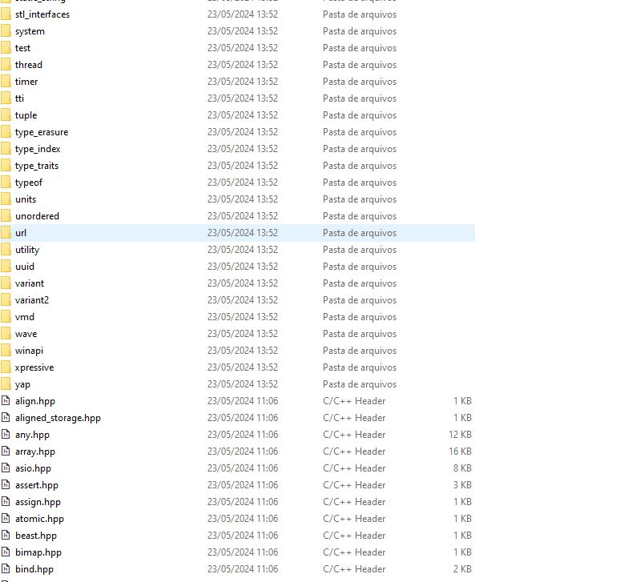
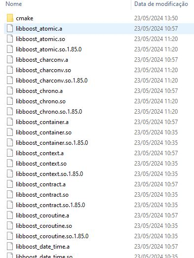

# How to install boost if you need

Create the following directorys(sensitive-case)

- boost\include
- lib

What will need be placed in this current directorys?
- boost\include: the boost librarys you want
- lib: the compiled .DLL's, library, .so, .a

To check if you done Right an example about how the dir will be is bellow

Inside directory: "ThirdParty/boost/include/boost"

Inside directory: "ThirdParty/boost/lib"(Note: in that image are compiled in linux environment)

